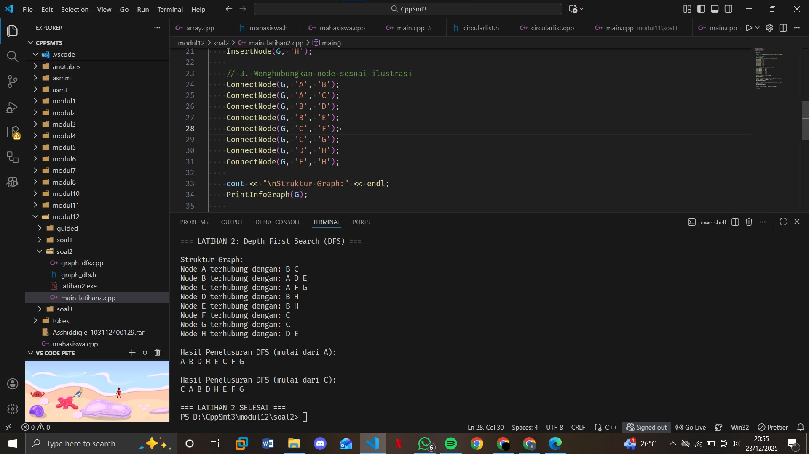
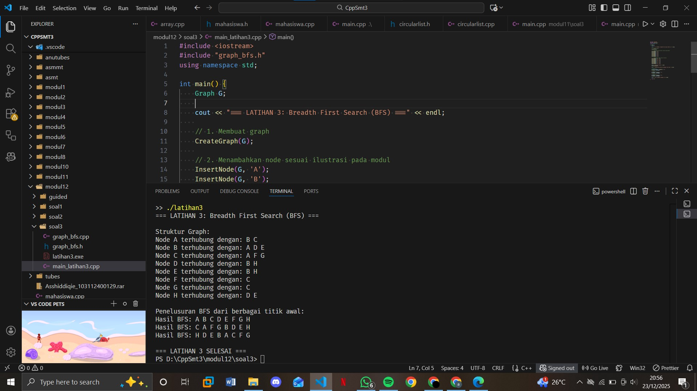

# <h1 align="center">Laporan Praktikum Modul 13 <br> GRAPH </h1>
<p align="center">ASSHIDDIQIE SYABANA PUTRA - 103112400129 </p>

## Dasar Teori

Graph adalah struktur data non-linear yang merepresentasikan himpunan objek (disebut vertex atau node) yang terhubung oleh sisi (edge) yang dapat memiliki arah (pada directed graph) maupun tidak (pada undirected graph). Dalam implementasinya, graph dapat direpresentasikan menggunakan adjacency matrix atau adjacency list (multilist), dengan adjacency list sering dipilih karena efisiensi memorinya untuk graph yang sparse. Algoritma dasar pada graph meliputi penelusuran seperti Breadth-First Search (BFS) yang menjelajahi graph per level dan Depth-First Search (DFS) yang menjelajahi secara mendalam, serta topological sort untuk mengurutkan vertex pada directed acyclic graph berdasarkan dependensi antar node.


## Guided

### graph.h
```go
#ifndef GRAF_H_INCLUDED
#define GRAF_H_INCLUDED

#include <iostream>
using namespace std;

typedef char infoGraph;

struct ElmNode;
struct ElmEdge;

typedef ElmNode *adrNode;
typedef ElmEdge *adrEdge;

struct ElmNode
{
    infoGraph info;
    int visited;
    adrEdge firstEdge;
    adrNode next;
};

struct ElmEdge
{
    adrNode node;
    adrEdge next;
};

struct Graph
{
    adrNode first;
};

// PRIMITIF GRAPH
void CreateGraph(Graph &G);
adrNode AllocateNode(infoGraph X);
adrEdge AllocateEdge(adrNode N);

void InsertNode(Graph &G, infoGraph X);
adrNode FindNode(Graph G, infoGraph X);

void ConnectNode(Graph &G, infoGraph A, infoGraph B);

void PrintInfoGraph(Graph G);

// Traversal
void ResetVisited(Graph &G);
void PrintDFS(Graph &G, adrNode N);
void PrintBFS(Graph &G, adrNode N);

#endif
```

### graph.cpp
```go

#include "graf.h"
#include <queue>
#include <stack>

void CreateGraph(Graph &G)
{
    G.first = NULL;
}

adrNode AllocateNode(infoGraph X)
{
    adrNode P = new ElmNode;
    P->info = X;
    P->visited = 0;
    P->firstEdge = NULL;
    P->next = NULL;
    return P;
}

adrEdge AllocateEdge(adrNode N)
{
    adrEdge P = new ElmEdge;
    P->node = N;
    P->next = NULL;
    return P;
}

void InsertNode(Graph &G, infoGraph X)
{
    adrNode P = AllocateNode(X);
    P->next = G.first;
    G.first = P;
}

adrNode FindNode(Graph G, infoGraph X)
{
    adrNode P = G.first;
    while (P != NULL)
    {
        if (P->info == X)
            return P;
        P = P->next;
    }
    return NULL;
}

void ConnectNode(Graph &G, infoGraph A, infoGraph B)
{
    adrNode N1 = FindNode(G, A);
    adrNode N2 = FindNode(G, B);

    if (N1 == NULL || N2 == NULL)
    {
        cout << "Node tidak ditemukan!\n";
        return;
    }

    // Buat edge dari N1 ke N2
    adrEdge E1 = AllocateEdge(N2);
    E1->next = N1->firstEdge;
    N1->firstEdge = E1;

    // Karena undirected → buat edge balik
    adrEdge E2 = AllocateEdge(N1);
    E2->next = N2->firstEdge;
    N2->firstEdge = E2;
}

void PrintInfoGraph(Graph G)
{
    adrNode P = G.first;
    while (P != NULL)
    {
        cout << P->info << " -> ";
        adrEdge E = P->firstEdge;
        while (E != NULL)
        {
            cout << E->node->info << " ";
            E = E->next;
        }
        cout << endl;
        P = P->next;
    }
}

void ResetVisited(Graph &G)
{
    adrNode P = G.first;
    while (P != NULL)
    {
        P->visited = 0;
        P = P->next;
    }
}

void PrintDFS(Graph &G, adrNode N)
{
    if (N == NULL)
        return;

    N->visited = 1;
    cout << N->info << " ";

    adrEdge E = N->firstEdge;
    while (E != NULL)
    {
        if (E->node->visited == 0)
        {
            PrintDFS(G, E->node);
        }
        E = E->next;
    }
}

void PrintBFS(Graph &G, adrNode N)
{
    if (N == NULL)
        return;

    queue<adrNode> Q;
    Q.push(N);

    while (!Q.empty())
    {
        adrNode curr = Q.front();
        Q.pop();

        if (curr->visited == 0)
        {
            curr->visited = 1;
            cout << curr->info << " ";

            adrEdge E = curr->firstEdge;
            while (E != NULL)
            {
                if (E->node->visited == 0)
                {
                    Q.push(E->node);
                }
                E = E->next;
            }
        }
    }
}

```

### main.cpp
```go
#include "graf.h"
#include "graf.cpp"
#include <iostream>
using namespace std;

int main()
{
    Graph G;
    CreateGraph(G);

    // Tambah node
    InsertNode(G, 'A');
    InsertNode(G, 'B');
    InsertNode(G, 'C');
    InsertNode(G, 'D');
    InsertNode(G, 'E');

    // Hubungkan node (graph tidak berarah)
    ConnectNode(G, 'A', 'B');
    ConnectNode(G, 'A', 'C');
    ConnectNode(G, 'B', 'D');
    ConnectNode(G, 'C', 'E');

    cout << "=== Struktur Graph ===\n";
    PrintInfoGraph(G);

    cout << "\n=== DFS dari Node A ===\n";
    ResetVisited(G);
    PrintDFS(G, FindNode(G, 'A'));

    cout << "\n\n=== BFS dari Node A ===\n";
    ResetVisited(G);
    PrintBFS(G, FindNode(G, 'A'));

    cout << endl;
    return 0;
}
```

## Unguided

### Soal 1

Buatlah ADT Graph tidak berarah file “graph.h”:
```
Type infoGraph: char 
Type adrNode : pointer to ElmNode 
Type adrEdge : pointer to ElmNode 
Type ElmNode  < 
info : infoGraph 
visited : integer 
firstEdge : adrEdge 
Next : adrNode 
> 
Type ElmEdge  < 
Node : adrNode 
Next : adrEdge 
> 
Type Graph  < 
first : adrNode 
> 
procedure CreateGraph (input/output G : Graph) 
procedure InsertNode (input/output G : Graph,  
input X : infotype) 
procedure ConnectNode (input/output N1, N2 : adrNode) 
procedure PrintInfoGraph (input G : Graph)
```
Buatlah implementasi ADT Graph pada file “graph.cpp” dan cobalah hasil implementasi ADT 
pada file “main.cpp”

### file graph.h
```cpp
#ifndef GRAPH_H_INCLUDE
#define GRAPH_H_INCLUDE

typedef char infoGraph;
typedef struct ElmNode *adrNode;
typedef struct ElmEdge *adrEdge;

struct ElmNode {
    infoGraph info;
    int visited;
    adrEdge firstEdge;
    adrNode Next;
};

struct ElmEdge {
    adrNode Node;
    adrEdge Next;
};

struct Graph {
    adrNode First;
};

// Function prototypes untuk Latihan 1
void CreateGraph(Graph &G);
adrNode AllocateNode(infoGraph X);
adrEdge AllocateEdge(adrNode N);
void InsertNode(Graph &G, infoGraph X);
adrNode FindNode(Graph G, infoGraph X);
void ConnectNode(Graph &G, infoGraph X1, infoGraph X2);
void PrintInfoGraph(Graph G);

#endif
```
### graph.cpp
```cpp
#include <iostream>
#include "graph.h"
using namespace std;

// 1. Membuat graph kosong
void CreateGraph(Graph &G) {
    G.First = NULL;
}

// Alokasi node baru
adrNode AllocateNode(infoGraph X) {
    adrNode P = new ElmNode;
    P->info = X;
    P->visited = 0;
    P->firstEdge = NULL;
    P->Next = NULL;
    return P;
}

// Alokasi edge baru
adrEdge AllocateEdge(adrNode N) {
    adrEdge P = new ElmEdge;
    P->Node = N;
    P->Next = NULL;
    return P;
}

// 2. Menyisipkan node baru ke dalam graph
void InsertNode(Graph &G, infoGraph X) {
    adrNode P = AllocateNode(X);
    
    if (G.First == NULL) {
        G.First = P;
    } else {
        adrNode Last = G.First;
        while (Last->Next != NULL) {
            Last = Last->Next;
        }
        Last->Next = P;
    }
}

// Mencari node berdasarkan info
adrNode FindNode(Graph G, infoGraph X) {
    adrNode P = G.First;
    while (P != NULL && P->info != X) {
        P = P->Next;
    }
    return P;
}

// 3. Menghubungkan dua node (graph tidak berarah)
void ConnectNode(Graph &G, infoGraph X1, infoGraph X2) {
    adrNode Node1 = FindNode(G, X1);
    adrNode Node2 = FindNode(G, X2);
    
    if (Node1 != NULL && Node2 != NULL) {
        // Tambah edge dari Node1 ke Node2
        adrEdge Edge1 = AllocateEdge(Node2);
        if (Node1->firstEdge == NULL) {
            Node1->firstEdge = Edge1;
        } else {
            adrEdge LastEdge = Node1->firstEdge;
            while (LastEdge->Next != NULL) {
                LastEdge = LastEdge->Next;
            }
            LastEdge->Next = Edge1;
        }
        
        // Tambah edge dari Node2 ke Node1 (karena graph tidak berarah)
        adrEdge Edge2 = AllocateEdge(Node1);
        if (Node2->firstEdge == NULL) {
            Node2->firstEdge = Edge2;
        } else {
            adrEdge LastEdge = Node2->firstEdge;
            while (LastEdge->Next != NULL) {
                LastEdge = LastEdge->Next;
            }
            LastEdge->Next = Edge2;
        }
    }
}

// 4. Mencetak semua node dan edge dalam graph
void PrintInfoGraph(Graph G) {
    adrNode P = G.First;
    
    while (P != NULL) {
        cout << "Node " << P->info << " terhubung dengan: ";
        
        adrEdge E = P->firstEdge;
        if (E == NULL) {
            cout << "(tidak ada)";
        } else {
            while (E != NULL) {
                cout << E->Node->info << " ";
                E = E->Next;
            }
        }
        cout << endl;
        P = P->Next;
    }
}
```
### file main.cpp
```cpp
#include <iostream>
#include "graph.h"
using namespace std;

int main() {
    Graph G;
    
    cout << "=== LATIHAN 1: Membuat ADT Graph Tidak Berarah ===" << endl;
    
    // 1. Membuat graph
    CreateGraph(G);
    
    // 2. Menambahkan node sesuai ilustrasi pada modul
    InsertNode(G, 'A');
    InsertNode(G, 'B');
    InsertNode(G, 'C');
    InsertNode(G, 'D');
    InsertNode(G, 'E');
    InsertNode(G, 'F');
    InsertNode(G, 'G');
    InsertNode(G, 'H');
    
    // 3. Menghubungkan node sesuai ilustrasi
    // Ilustrasi dari gambar di modul (halaman 14-14)
    ConnectNode(G, 'A', 'B');
    ConnectNode(G, 'A', 'C');
    ConnectNode(G, 'B', 'D');
    ConnectNode(G, 'B', 'E');
    ConnectNode(G, 'C', 'F');
    ConnectNode(G, 'C', 'G');
    ConnectNode(G, 'D', 'H');
    ConnectNode(G, 'E', 'H');
    
    cout << "\nHasil Implementasi ADT Graph:" << endl;
    PrintInfoGraph(G);
    
    cout << "\n=== LATIHAN 1 SELESAI ===" << endl;
    
    return 0;
}
```

> Output
> 

Penjelasan :
bertujuan untuk mengimplementasikan ADT Graph tidak berarah menggunakan struktur data multilist sesuai konsep dalam modul, di mana setiap node direpresentasikan dengan struktur ElmNode yang berisi informasi node dan pointer ke list edge, serta setiap edge direpresentasikan dengan struktur ElmEdge yang menunjuk ke node tetangga. Implementasi ini mencakup operasi dasar seperti CreateGraph untuk inisialisasi graph kosong, InsertNode untuk menambah node baru, ConnectNode untuk menghubungkan dua node secara dua arah (karena graph tidak berarah), dan PrintInfoGraph untuk menampilkan struktur graph lengkap beserta hubungan antar node, sehingga membentuk dasar struktur data graph yang dinamis menggunakan pointer.

## soal 2
Buatlah prosedur untuk menampilkanhasil penelusuran DFS. 
prosedur PrintDFS (Graph G, adrNode N); 

### file graph_dfs.h
```cpp
#ifndef GRAPH_DFS_H_INCLUDE
#define GRAPH_DFS_H_INCLUDE

typedef char infoGraph;
typedef struct ElmNode *adrNode;
typedef struct ElmEdge *adrEdge;

struct ElmNode {
    infoGraph info;
    int visited;
    adrEdge firstEdge;
    adrNode Next;
};

struct ElmEdge {
    adrNode Node;
    adrEdge Next;
};

struct Graph {
    adrNode First;
};

// Function prototypes untuk Latihan 2
void CreateGraph(Graph &G);
adrNode AllocateNode(infoGraph X);
adrEdge AllocateEdge(adrNode N);
void InsertNode(Graph &G, infoGraph X);
adrNode FindNode(Graph G, infoGraph X);
void ConnectNode(Graph &G, infoGraph X1, infoGraph X2);
void PrintInfoGraph(Graph G);
void ResetVisited(Graph &G);
void PrintDFS(Graph &G, adrNode N);

#endif
```
### file graph_dfs.cpp
```cpp
#include <iostream>
#include "graph_dfs.h"
using namespace std;

// 1. Membuat graph kosong
void CreateGraph(Graph &G) {
    G.First = NULL;
}

// Alokasi node baru
adrNode AllocateNode(infoGraph X) {
    adrNode P = new ElmNode;
    P->info = X;
    P->visited = 0;
    P->firstEdge = NULL;
    P->Next = NULL;
    return P;
}

// Alokasi edge baru
adrEdge AllocateEdge(adrNode N) {
    adrEdge P = new ElmEdge;
    P->Node = N;
    P->Next = NULL;
    return P;
}

// 2. Menyisipkan node baru ke dalam graph
void InsertNode(Graph &G, infoGraph X) {
    adrNode P = AllocateNode(X);
    
    if (G.First == NULL) {
        G.First = P;
    } else {
        adrNode Last = G.First;
        while (Last->Next != NULL) {
            Last = Last->Next;
        }
        Last->Next = P;
    }
}

// Mencari node berdasarkan info
adrNode FindNode(Graph G, infoGraph X) {
    adrNode P = G.First;
    while (P != NULL && P->info != X) {
        P = P->Next;
    }
    return P;
}

// 3. Menghubungkan dua node (graph tidak berarah)
void ConnectNode(Graph &G, infoGraph X1, infoGraph X2) {
    adrNode Node1 = FindNode(G, X1);
    adrNode Node2 = FindNode(G, X2);
    
    if (Node1 != NULL && Node2 != NULL) {
        // Tambah edge dari Node1 ke Node2
        adrEdge Edge1 = AllocateEdge(Node2);
        if (Node1->firstEdge == NULL) {
            Node1->firstEdge = Edge1;
        } else {
            adrEdge LastEdge = Node1->firstEdge;
            while (LastEdge->Next != NULL) {
                LastEdge = LastEdge->Next;
            }
            LastEdge->Next = Edge1;
        }
        
        // Tambah edge dari Node2 ke Node1 (karena graph tidak berarah)
        adrEdge Edge2 = AllocateEdge(Node1);
        if (Node2->firstEdge == NULL) {
            Node2->firstEdge = Edge2;
        } else {
            adrEdge LastEdge = Node2->firstEdge;
            while (LastEdge->Next != NULL) {
                LastEdge = LastEdge->Next;
            }
            LastEdge->Next = Edge2;
        }
    }
}

// 4. Mencetak semua node dan edge dalam graph
void PrintInfoGraph(Graph G) {
    adrNode P = G.First;
    
    while (P != NULL) {
        cout << "Node " << P->info << " terhubung dengan: ";
        
        adrEdge E = P->firstEdge;
        if (E == NULL) {
            cout << "(tidak ada)";
        } else {
            while (E != NULL) {
                cout << E->Node->info << " ";
                E = E->Next;
            }
        }
        cout << endl;
        P = P->Next;
    }
}

// 5. Reset status visited semua node
void ResetVisited(Graph &G) {
    adrNode P = G.First;
    while (P != NULL) {
        P->visited = 0;
        P = P->Next;
    }
}

// 6. Depth First Search (DFS) - Latihan 2
void PrintDFS(Graph &G, adrNode N) {
    if (N == NULL || N->visited == 1) {
        return;
    }
    
    // Tandai node sebagai sudah dikunjungi
    N->visited = 1;
    cout << N->info << " ";
    
    // Kunjungi semua tetangga secara rekursif
    adrEdge E = N->firstEdge;
    while (E != NULL) {
        PrintDFS(G, E->Node);
        E = E->Next;
    }
}
```
### file main_latihan2.cpp
```cpp
#include <iostream>
#include "graph_dfs.h"
using namespace std;

int main() {
    Graph G;
    
    cout << "=== LATIHAN 2: Depth First Search (DFS) ===" << endl;
    
    // 1. Membuat graph
    CreateGraph(G);
    
    // 2. Menambahkan node sesuai ilustrasi pada modul
    InsertNode(G, 'A');
    InsertNode(G, 'B');
    InsertNode(G, 'C');
    InsertNode(G, 'D');
    InsertNode(G, 'E');
    InsertNode(G, 'F');
    InsertNode(G, 'G');
    InsertNode(G, 'H');
    
    // 3. Menghubungkan node sesuai ilustrasi
    ConnectNode(G, 'A', 'B');
    ConnectNode(G, 'A', 'C');
    ConnectNode(G, 'B', 'D');
    ConnectNode(G, 'B', 'E');
    ConnectNode(G, 'C', 'F');
    ConnectNode(G, 'C', 'G');
    ConnectNode(G, 'D', 'H');
    ConnectNode(G, 'E', 'H');
    
    cout << "\nStruktur Graph:" << endl;
    PrintInfoGraph(G);
    
    cout << "\nHasil Penelusuran DFS (mulai dari A):" << endl;
    ResetVisited(G);
    adrNode StartNode = FindNode(G, 'A');
    PrintDFS(G, StartNode);
    
    cout << "\n\nHasil Penelusuran DFS (mulai dari C):" << endl;
    ResetVisited(G);
    StartNode = FindNode(G, 'C');
    PrintDFS(G, StartNode);
    
    cout << "\n\n=== LATIHAN 2 SELESAI ===" << endl;
    
    return 0;
}
```

> Output
> 

Penjelasan :
mengimplementasikan algoritma Depth First Search (DFS) pada graph yang telah dibangun, menggunakan pendekatan rekursif untuk menjelajahi graph secara mendalam dengan mengunjungi satu cabang hingga tuntas sebelum berpindah ke cabang lain. Algoritma ini dimulai dari node awal yang ditandai sebagai visited, kemudian secara rekursif mengunjungi semua tetangga yang belum dikunjungi, menghasilkan urutan node yang mencerminkan penelusuran depth-first, dengan contoh hasil seperti A B D H E C F G ketika mulai dari node A, sesuai dengan konsep traversal dalam modul.

## soal 3
Buatlah prosedur untuk menampilkanhasil penelusuran DFS. 
prosedur PrintBFS (Graph G, adrNode N); 

### file graph_bfs.h
```cpp
#ifndef GRAPH_BFS_H_INCLUDE
#define GRAPH_BFS_H_INCLUDE

typedef char infoGraph;
typedef struct ElmNode *adrNode;
typedef struct ElmEdge *adrEdge;

struct ElmNode {
    infoGraph info;
    int visited;
    adrEdge firstEdge;
    adrNode Next;
};

struct ElmEdge {
    adrNode Node;
    adrEdge Next;
};

struct Graph {
    adrNode First;
};

// Function prototypes untuk Latihan 3
void CreateGraph(Graph &G);
adrNode AllocateNode(infoGraph X);
adrEdge AllocateEdge(adrNode N);
void InsertNode(Graph &G, infoGraph X);
adrNode FindNode(Graph G, infoGraph X);
void ConnectNode(Graph &G, infoGraph X1, infoGraph X2);
void PrintInfoGraph(Graph G);
void ResetVisited(Graph &G);
void PrintBFS(Graph &G, adrNode Start);

#endif
```
### file graph_bfs.cpp
```cpp
#include <iostream>
#include "graph_bfs.h"
using namespace std;

// 1. Membuat graph kosong
void CreateGraph(Graph &G) {
    G.First = NULL;
}

// Alokasi node baru
adrNode AllocateNode(infoGraph X) {
    adrNode P = new ElmNode;
    P->info = X;
    P->visited = 0;
    P->firstEdge = NULL;
    P->Next = NULL;
    return P;
}

// Alokasi edge baru
adrEdge AllocateEdge(adrNode N) {
    adrEdge P = new ElmEdge;
    P->Node = N;
    P->Next = NULL;
    return P;
}

// 2. Menyisipkan node baru ke dalam graph
void InsertNode(Graph &G, infoGraph X) {
    adrNode P = AllocateNode(X);
    
    if (G.First == NULL) {
        G.First = P;
    } else {
        adrNode Last = G.First;
        while (Last->Next != NULL) {
            Last = Last->Next;
        }
        Last->Next = P;
    }
}

// Mencari node berdasarkan info
adrNode FindNode(Graph G, infoGraph X) {
    adrNode P = G.First;
    while (P != NULL && P->info != X) {
        P = P->Next;
    }
    return P;
}

// 3. Menghubungkan dua node (graph tidak berarah)
void ConnectNode(Graph &G, infoGraph X1, infoGraph X2) {
    adrNode Node1 = FindNode(G, X1);
    adrNode Node2 = FindNode(G, X2);
    
    if (Node1 != NULL && Node2 != NULL) {
        // Tambah edge dari Node1 ke Node2
        adrEdge Edge1 = AllocateEdge(Node2);
        if (Node1->firstEdge == NULL) {
            Node1->firstEdge = Edge1;
        } else {
            adrEdge LastEdge = Node1->firstEdge;
            while (LastEdge->Next != NULL) {
                LastEdge = LastEdge->Next;
            }
            LastEdge->Next = Edge1;
        }
        
        // Tambah edge dari Node2 ke Node1 (karena graph tidak berarah)
        adrEdge Edge2 = AllocateEdge(Node1);
        if (Node2->firstEdge == NULL) {
            Node2->firstEdge = Edge2;
        } else {
            adrEdge LastEdge = Node2->firstEdge;
            while (LastEdge->Next != NULL) {
                LastEdge = LastEdge->Next;
            }
            LastEdge->Next = Edge2;
        }
    }
}

// 4. Mencetak semua node dan edge dalam graph
void PrintInfoGraph(Graph G) {
    adrNode P = G.First;
    
    while (P != NULL) {
        cout << "Node " << P->info << " terhubung dengan: ";
        
        adrEdge E = P->firstEdge;
        if (E == NULL) {
            cout << "(tidak ada)";
        } else {
            while (E != NULL) {
                cout << E->Node->info << " ";
                E = E->Next;
            }
        }
        cout << endl;
        P = P->Next;
    }
}

// 5. Reset status visited semua node
void ResetVisited(Graph &G) {
    adrNode P = G.First;
    while (P != NULL) {
        P->visited = 0;
        P = P->Next;
    }
}

// 6. Breadth First Search (BFS) - Latihan 3
void PrintBFS(Graph &G, adrNode Start) {
    if (Start == NULL) return;
    
    // Reset visited status
    ResetVisited(G);
    
    // Buat queue sederhana menggunakan array
    const int MAX = 100;
    adrNode queue[MAX];
    int front = 0, rear = 0;
    
    // Enqueue node awal
    queue[rear] = Start;
    rear++;
    Start->visited = 1;
    
    cout << "Hasil BFS: ";
    
    while (front < rear) {
        // Dequeue
        adrNode Current = queue[front];
        front++;
        
        // Cetak node
        cout << Current->info << " ";
        
        // Enqueue semua tetangga yang belum dikunjungi
        adrEdge E = Current->firstEdge;
        while (E != NULL) {
            if (E->Node->visited == 0) {
                E->Node->visited = 1;
                queue[rear] = E->Node;
                rear++;
            }
            E = E->Next;
        }
    }
    cout << endl;
}
```
### file main_latihan3.cpp
```cpp
#include <iostream>
#include "graph_bfs.h"
using namespace std;

int main() {
    Graph G;
    
    cout << "=== LATIHAN 3: Breadth First Search (BFS) ===" << endl;
    
    // 1. Membuat graph
    CreateGraph(G);
    
    // 2. Menambahkan node sesuai ilustrasi pada modul
    InsertNode(G, 'A');
    InsertNode(G, 'B');
    InsertNode(G, 'C');
    InsertNode(G, 'D');
    InsertNode(G, 'E');
    InsertNode(G, 'F');
    InsertNode(G, 'G');
    InsertNode(G, 'H');
    
    // 3. Menghubungkan node sesuai ilustrasi
    ConnectNode(G, 'A', 'B');
    ConnectNode(G, 'A', 'C');
    ConnectNode(G, 'B', 'D');
    ConnectNode(G, 'B', 'E');
    ConnectNode(G, 'C', 'F');
    ConnectNode(G, 'C', 'G');
    ConnectNode(G, 'D', 'H');
    ConnectNode(G, 'E', 'H');
    
    cout << "\nStruktur Graph:" << endl;
    PrintInfoGraph(G);
    
    cout << "\nPenelusuran BFS dari berbagai titik awal:" << endl;
    
    // BFS dari A
    adrNode StartNode = FindNode(G, 'A');
    PrintBFS(G, StartNode);
    
    // BFS dari C
    StartNode = FindNode(G, 'C');
    PrintBFS(G, StartNode);
    
    // BFS dari H
    StartNode = FindNode(G, 'H');
    PrintBFS(G, StartNode);
    
    cout << "\n=== LATIHAN 3 SELESAI ===" << endl;
    
    return 0;
}
```

> Output
> 

Penjelasan :
mengimplementasikan algoritma Breadth First Search (BFS) yang menggunakan struktur queue untuk menjelajahi graph secara melebar per level, di mana node awal dimasukkan ke queue kemudian dikunjungi dan semua tetangganya yang belum dikunjungi dimasukkan ke queue, menghasilkan urutan node seperti A B C D E F G H ketika mulai dari node A. Implementasi ini sesuai dengan pseudocode BFS dalam modul dan menggunakan array sebagai queue sederhana, menunjukkan perbedaan fundamental dengan DFS dalam strategi penelusuran graph.

1. https://www.w3schools.com/cpp/cpp_for_loop_nested.asp
2. https://www.w3schools.com/cpp/cpp_arrays.asp
3. https://www.w3schools.com/cpp/cpp_arrays_loop.asp
4. https://www.w3schools.com/cpp/cpp_references.asp
5. https://www.w3schools.com/cpp/cpp_pointers.asp
6. https://www.w3schools.com/cpp/cpp_function_param.asp
7. https://www.w3schools.com/cpp/cpp_function_array.asp
8. https://www.w3schools.com/cpp/cpp_stacks.asp

