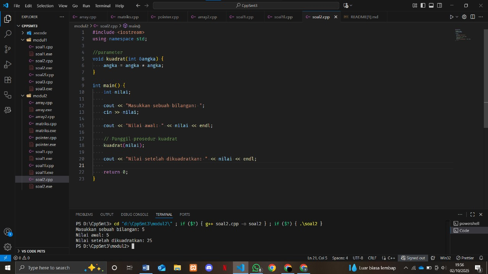

# <h1 align="center">Laporan Praktikum Modul X <br> Nama Modul</h1>
<p align="center">NAMA - NIM</p>

## Dasar Teori

yang panjang dikit

## Guided

### call by pointer

```go
#include <iostream>
using namespace std;

int main()
{
    int a = 10, b = 20;
    cout << "Sebelum ditukar: a = " << a << ", b = " << b << endl;
    tukar(&a, &b);
    cout << "Setelah ditukar: a = " << a << ", b = " << b << endl;
    return 0;
}

void tukar(int *px, int *py)
{
    int temp = *px;
    *px = *py;
    *py = temp;
}
```

### call by reference

```go
#include <iostream>
using namespace std;

int main()
{
    int a = 10, b = 20;
    cout << "Sebelum ditukar: a = " << a << ", b = " << b << endl;
    tukar(a, b);
    cout << "Setelah ditukar: a = " << a << ", b = " << b << endl;
    return 0;
}

void tukar(int &x, int &y)
{
    int temp = x;
    x = y;
    y = temp;
}
```

## Unguided

### Soal 1

Buatlah sebuah program untuk melakukan transpose pada sebuah matriks persegi berukuran 3x3. Operasi transpose adalah mengubah baris menjadi kolom dan sebaliknya. Inisialisasi matriks awal di dalam kode, kemudian buat logika untuk melakukan transpose dan simpan hasilnya ke dalam matriks baru. Terakhir, tampilkan matriks awal dan matriks hasil transpose.

Contoh Output:

Matriks Awal:

1 2 3

4 5 6

7 8 9

Matriks Hasil Transpose:

1 4 7

2 5 8

3 6 9


```go
#include <iostream>
using namespace std;

int main() {
    int matriks[3][3], transpose[3][3];
    
    // Input matriks
    cout << "Masukkan elemen matriks 3x3:\n";
    for (int i = 0; i < 3; i++) {
        for (int j = 0; j < 3; j++) {
            cin >> matriks[i][j];
        }
    }
    
    // Proses transpose
    for (int i = 0; i < 3; i++) {
        for (int j = 0; j < 3; j++) {
            transpose[j][i] = matriks[i][j];
        }
    }
    
    // Tampilkan matriks awal
    cout << "\nMatriks Awal:\n";
    for (int i = 0; i < 3; i++) {
        for (int j = 0; j < 3; j++) {
            cout << matriks[i][j] << " ";
        }
        cout << endl;
    }
    
    // Tampilkan hasil transpose
    cout << "\nMatriks Transpose:\n";
    for (int i = 0; i < 3; i++) {
        for (int j = 0; j < 3; j++) {
            cout << transpose[i][j] << " ";
        }
        cout << endl;
    }
    
    return 0;
}
```

> Output
> 
> %% Untuk mencantumkan screenshot, tidak boleh ada spasi di urlnya `()`, penamaan file bebas asal gak sara dan mudah dipahami aja,, dan jangan lupa hapus komen ini yah%%

Penjelasan ttg kode kalian disini

### Soal 2

Buatlah program yang menunjukkan penggunaan call by reference. Buat sebuah prosedur bernama kuadratkan yang menerima satu parameter integer secara referensi (&). Prosedur ini akan mengubah nilai asli variabel yang dilewatkan dengan nilai kuadratnya. Tampilkan nilai variabel di main() sebelum dan sesudah memanggil prosedur untuk membuktikan perubahannya. 

Contoh Output:

Nilai awal: 5
Nilai setelah dikuadratkan: 25

```go
#include <iostream>
using namespace std;

//parameter
void kuadrat(int &angka) {
    angka = angka * angka;
}

int main() {
    int nilai;
    
    cout << "Masukkan sebuah bilangan: ";
    cin >> nilai;
    
    // Tampilkan nilai awal
    cout << "Nilai awal: " << nilai << endl;
    
    // Panggil prosedur kuadrat
    kuadrat(nilai);
    
    cout << "Nilai setelah dikuadratkan: " << nilai << endl;
    
    return 0;
}
```

> Output
> 

Penjelasan Kode:

1. void = Prosedur ini tidak mengembalikan nilai (return). Dia hanya mengubah nilai parameter yang dikirim.
2. int &angka = Parameter dengan tanda & (ampersand). Ini adalah KUNCI dari call by reference!
    & membuat angka menjadi alias (nama lain) untuk variabel asli
    Bukan salinan, tapi referensi langsung ke variabel asli
3. angka = angka * angka = Mengkuadratkan nilai
    Jika angka = 5, maka 5 × 5 = 25
    Karena angka adalah reference, perubahan ini langsung mempengaruhi variabel asli di main()

Program ini berfungsi untuk mengkuadratkan bilangan yang dimasukkan pengguna menggunakan parameter referensi sehingga nilai variabel langsung berubah.

## Referensi

1. https://www.w3schools.com/cpp/cpp_for_loop_nested.asp
2. https://www.w3schools.com/cpp/cpp_arrays.asp
3. https://www.w3schools.com/cpp/cpp_arrays_loop.asp
4. https://www.w3schools.com/cpp/cpp_references.asp
5. https://www.w3schools.com/cpp/cpp_pointers.asp
6. https://www.w3schools.com/cpp/cpp_function_param.asp
7. https://www.w3schools.com/cpp/cpp_function_array.asp

