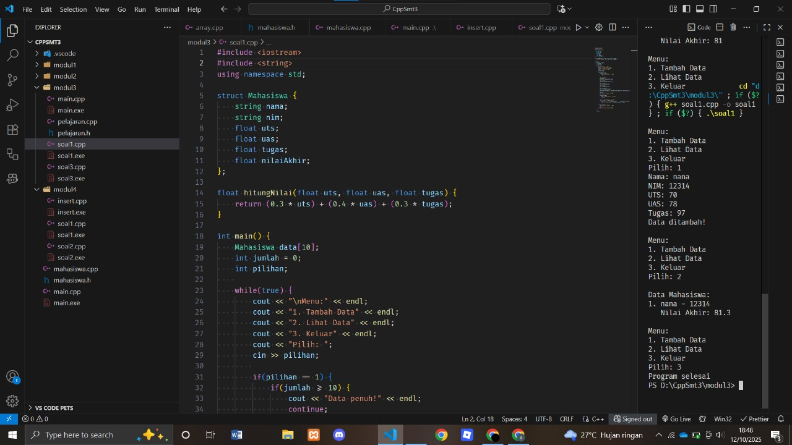
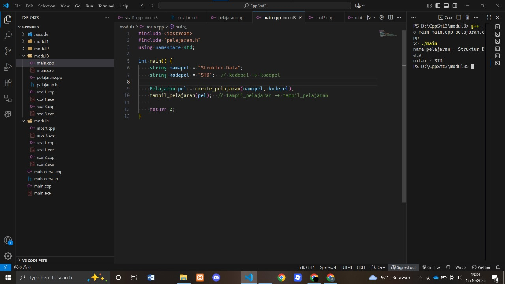
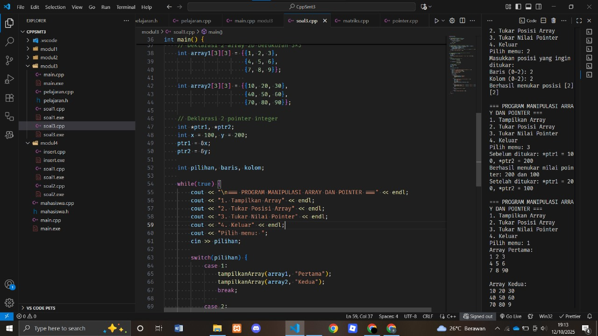

# <h1 align="center">Laporan Praktikum Modul 3 <br> ABSTRACT DATA TYPE (ADT)</h1>
<p align="center">ASSHIDDIQIE SYABANA PUTRA - 103112400129</p>

## Dasar Teori

Abstract Data Type (ADT) adalah sebuah tipe data yang didefinisikan beserta dengan sekumpulan operasi primitifnya, di mana detail implementasinya disembunyikan dari pengguna. Konsep ini diwujudkan dengan memisahkan spesifikasi tipe dan fungsi ke dalam file header (.h) dan realisasi kodenya ke dalam file implementasi (.cpp), sehingga meningkatkan modularitas, abstraksi, dan kemudahan maintenance dalam pemrograman.
## Guided

### Mahasiswa.cpp

```go
#include "mahasiswa.h"
#include <iostream>
using namespace std;

void inputMhs(mahasiswa &m)
{
    cout << "input nama = ";
    cin >> (m).nim;
    cout << "input nilai = ";
    cin >> (m).nilai1;
    cout << "input nilai2 = ";
    cin >> (m).nilai2;

}
float rata2(mahasiswa m)

{
    return float(m.nilai1 + m.nilai2) / 2;
}

```

### Mahasiswa.h
```go
#include "mahasiswa.h"
#include <iostream>
using namespace std;

void inputMhs(mahasiswa &m)
{
    cout << "input nama = ";
    cin >> (m).nim;
    cout << "input nilai = ";
    cin >> (m).nilai1;
    cout << "input nilai2 = ";
    cin >> (m).nilai2;

}
float rata2(mahasiswa m)

{
    return float(m.nilai1 + m.nilai2) / 2;
}
```
### main.cpp
```go
#include <iostream>
#include "mahasiswa.h"
using namespace std;

int main()
{
    mahasiswa mhs;
    inputMhs(mhs);
    cout << "rata-rata = " << rata2(mhs);
    return 0;
}
```
## Unguided


### Soal 1

Buat program yang dapat menyimpan data mahasiswa (max. 10) ke dalam sebuah array dengan field nama, nim, uts, uas, tugas, dan nilai akhir. Nilai akhir diperoleh dari FUNGSI dengan rumus 0.3*uts+0.4*uas+0.3*tugas.

```go
#include <iostream>
#include <string>
using namespace std;

struct Mahasiswa {
    string nama;
    string nim;
    float uts;
    float uas;
    float tugas;
    float nilaiAkhir;
};

float hitungNilai(float uts, float uas, float tugas) {
    return (0.3 * uts) + (0.4 * uas) + (0.3 * tugas);
}

int main() {
    Mahasiswa data[10];
    int jumlah = 0;
    int pilihan;
    
    while(true) {
        cout << "\nMenu:" << endl;
        cout << "1. Tambah Data" << endl;
        cout << "2. Lihat Data" << endl;
        cout << "3. Keluar" << endl;
        cout << "Pilih: ";
        cin >> pilihan;
        
        if(pilihan == 1) {
            if(jumlah >= 10) {
                cout << "Data penuh!" << endl;
                continue;
            }
            
            cout << "Nama: ";
            cin.ignore();
            getline(cin, data[jumlah].nama);
            
            cout << "NIM: ";
            getline(cin, data[jumlah].nim);
            
            cout << "UTS: ";
            cin >> data[jumlah].uts;
            
            cout << "UAS: ";
            cin >> data[jumlah].uas;
            
            cout << "Tugas: ";
            cin >> data[jumlah].tugas;
            
            data[jumlah].nilaiAkhir = hitungNilai(data[jumlah].uts, data[jumlah].uas, data[jumlah].tugas);
            
            jumlah++;
            cout << "Data ditambah!" << endl;
            
        } else if(pilihan == 2) {
            if(jumlah == 0) {
                cout << "Belum ada data!" << endl;
                continue;
            }
            
            cout << "\nData Mahasiswa:" << endl;
            for(int i = 0; i < jumlah; i++) {
                cout << i+1 << ". " << data[i].nama << " - " << data[i].nim << endl;
                cout << "   Nilai Akhir: " << data[i].nilaiAkhir << endl;
            }
            
        } else if(pilihan == 3) {
            cout << "Program selesai" << endl;
            break;
        } else {
            cout << "Pilihan salah!" << endl;
        }
    }
    
    return 0;
}
```

> Output
> 

Program C++ ini adalah sistem manajemen nilai mahasiswa yang menggunakan struct untuk menyimpan data seperti nama, NIM, dan nilai. Program menampilkan menu yang memungkinkan pengguna untuk menambah data (maksimal 10 mahasiswa), melihat data yang sudah dimasukkan, atau keluar. Setiap data baru akan otomatis menghitung nilai akhir dengan rumus 30% UTS, 40% UAS, dan 30% tugas. Semua data disimpan dalam array of struct dan program akan berjalan dalam loop hingga pengguna memilih untuk berhenti.

### Soal 2

Buatlah ADT pelajaran sebagai berikut di dalam file “pelajaran.h”:
```go
goType pelajaran <
namaMapel : string
kodeMapel : string
>
function create_pelajaran( namapel : string,
kodepel : string ) → pelajaran
procedure tampil_pelajaran( input pel : pelajaran )
```
Buatlah implementasi ADT pelajaran pada file “pelajaran.cpp”

Cobalah hasil implementasi ADT pada file “main.cpp”

### file pelajaran.cpp
```go
#include "pelajaran.h"
#include <iostream>
using namespace std;

// Implementasi function create_pelajaran
Pelajaran create_pelajaran(string namaMapel, string kodeMapel) {
    Pelajaran pel;
    pel.namaMapel = namaMapel;
    pel.kodeMapel = kodeMapel;
    return pel;
}

// Implementasi procedure tampil_pelajaran
void tampil_pelajaran(Pelajaran pel) {
    cout << "nama pelajaran : " << pel.namaMapel << endl;
    cout << "nilai : " << pel.kodeMapel << endl;
}
```
### file pelajaran.h
```go
#ifndef PELAJARAN_H
#define PELAJARAN_H

#include <iostream>
#include <string>
using namespace std;

struct Pelajaran {
    string namaMapel;  // namawape1 -> namaMapel
    string kodeMapel;  // kodewape1 -> kodeMapel
};

Pelajaran create_pelajaran(string namaMapel, string kodeMapel);

void tampil_pelajaran(Pelajaran pel);

#endif
```
### file main.cpp
```go
#include <iostream>
#include "pelajaran.h"
using namespace std;

int main() {
    string namapel = "Struktur Data";
    string kodepel = "STD";  // kodepe1 -> kodepel

    Pelajaran pel = create_pelajaran(namapel, kodepel);
    tampil_pelajaran(pel);  // tampi1_pelajaran -> tampil_pelajaran
    
    return 0;
}
```

> Output
> 

File pelajaran.h: Header file yang berisi definisi struct pelajaran (dengan field namaPel dan kodePel) serta deklarasi fungsi create_pelajaran() dan tampil_pelajaran(), dilindungi header guard untuk mencegah multiple inclusion. File ini menjadi jembatan penghubung antara implementasi (pelajaran.cpp) dan program utama (main.cpp), dimana kedua file tersebut harus meng-include pelajaran.h untuk mengakses definisi struct dan fungsi yang tersedia.

File pelajaran.cpp: File implementasi yang meng-include pelajaran.h untuk mendapatkan deklarasi fungsi, kemudian memberikan body/isi dari fungsi create_pelajaran() yang membuat dan mengembalikan objek pelajaran, serta tampil_pelajaran() yang menampilkan data pelajaran. File ini bergantung pada pelajaran.h untuk mengetahui struktur data dan fungsi apa yang harus diimplementasikan, dan menyediakan fungsionalitas yang akan digunakan oleh main.cpp.

File main.cpp: Program utama yang meng-include pelajaran.h untuk mengakses struct dan fungsi, lalu menggunakan fungsi-fungsi yang sudah diimplementasikan di pelajaran.cpp dengan membuat objek pelajaran melalui create_pelajaran() dan menampilkannya dengan tampil_pelajaran(). File ini tidak perlu tahu bagaimana fungsi-fungsi tersebut diimplementasikan (information hiding), cukup tahu cara menggunakannya dari deklarasi di header file.

Hubungan Ketiganya: pelajaran.h sebagai interface → pelajaran.cpp sebagai implementasi → main.cpp sebagai user/client, sehingga ketika dikompilasi bersama (g++ main.cpp pelajaran.cpp -o program), compiler akan menggabungkan ketiganya menjadi satu program executable yang utuh, menerapkan prinsip modular programming dan encapsulation dalam ADT.


### Soal 3

Buatlah program dengan ketentuan :
- 2 buah array 2D integer berukuran 3x3 dan 2 buah pointer integer
- fungsi/prosedur yang menampilkan isi sebuah array integer 2D
- fungsi/prosedur yang akan menukarkan isi dari 2 array integer 2D pada posisi tertentu
- fungsi/prosedur yang akan menukarkan isi dari variabel yang ditunjuk oleh 2 buah
pointer

```go
#include <iostream>
using namespace std;

// Fungsi untuk menampilkan isi array 2D
void tampilkanArray(int arr[3][3], string nama) {
    cout << "Array " << nama << ":" << endl;
    for(int i = 0; i < 3; i++) {
        for(int j = 0; j < 3; j++) {
            cout << arr[i][j] << " ";
        }
        cout << endl;
    }
    cout << endl;
}

// Fungsi untuk menukar isi dua array 2D pada posisi tertentu
void tukarPosisiArray(int arr1[3][3], int arr2[3][3], int baris, int kolom) {
    if(baris >= 0 && baris < 3 && kolom >= 0 && kolom < 3) {
        int temp = arr1[baris][kolom];
        arr1[baris][kolom] = arr2[baris][kolom];
        arr2[baris][kolom] = temp;
        cout << "Berhasil menukar posisi [" << baris << "][" << kolom << "]" << endl;
    } else {
        cout << "Posisi tidak valid!" << endl;
    }
}

// Fungsi untuk menukar isi variabel yang ditunjuk oleh dua pointer
void tukarPointer(int *a, int *b) {
    int temp = *a;
    *a = *b;
    *b = temp;
    cout << "Berhasil menukar nilai pointer: " << *a << " dan " << *b << endl;
}

int main() {
    // Deklarasi 2 array 2D berukuran 3x3
    int array1[3][3] = {{1, 2, 3},
                        {4, 5, 6},
                        {7, 8, 9}};
                        
    int array2[3][3] = {{10, 20, 30},
                        {40, 50, 60},
                        {70, 80, 90}};
    
    // Deklarasi 2 pointer integer
    int *ptr1, *ptr2;
    int x = 100, y = 200;
    ptr1 = &x;
    ptr2 = &y;
    
    int pilihan, baris, kolom;
    
    while(true) {
        cout << "\n=== PROGRAM MANIPULASI ARRAY DAN POINTER ===" << endl;
        cout << "1. Tampilkan Array" << endl;
        cout << "2. Tukar Posisi Array" << endl;
        cout << "3. Tukar Nilai Pointer" << endl;
        cout << "4. Keluar" << endl;
        cout << "Pilih menu: ";
        cin >> pilihan;
        
        switch(pilihan) {
            case 1:
                tampilkanArray(array1, "Pertama");
                tampilkanArray(array2, "Kedua");
                break;
                
            case 2:
                cout << "Masukkan posisi yang ingin ditukar:" << endl;
                cout << "Baris (0-2): ";
                cin >> baris;
                cout << "Kolom (0-2): ";
                cin >> kolom;
                tukarPosisiArray(array1, array2, baris, kolom);
                break;
                
            case 3:
                cout << "Sebelum ditukar: *ptr1 = " << *ptr1 << ", *ptr2 = " << *ptr2 << endl;
                tukarPointer(ptr1, ptr2);
                cout << "Setelah ditukar: *ptr1 = " << *ptr1 << ", *ptr2 = " << *ptr2 << endl;
                break;
                
            case 4:
                cout << "Program selesai." << endl;
                return 0;
                
            default:
                cout << "Pilihan tidak valid!" << endl;
        }
    }
    
    return 0;
}
```

> Output
> 

**Penjelasan Program (Ringkas):**

Program ini mengimplementasikan manipulasi array 2D dan pointer dengan tiga fungsi utama: tampilkanArray() untuk menampilkan isi array 2D, tukarPosisiArray() untuk menukar nilai dua array pada posisi tertentu dengan validasi, dan tukarPointer() untuk menukar nilai yang ditunjuk dua pointer menggunakan variabel temporary. Program mendeklarasikan dua array 3x3 (array1: 1-9, array2: 10-90) dan dua pointer (ptr1→100, ptr2→200). Menu interaktif menggunakan loop dan switch-case menyediakan empat pilihan: tampilkan array, tukar posisi array berdasarkan input baris-kolom dari user, tukar nilai pointer dengan menampilkan nilai sebelum dan sesudah, serta keluar program. Semua fungsi menggunakan pass by reference sehingga perubahan bersifat permanen dan memberikan feedback ke user.

## Referensi

1. https://www.w3schools.com/cpp/cpp_for_loop.asp
2. https://www.w3schools.com/cpp/cpp_conditions.asp
3. https://www.w3schools.com/cpp/cpp_conditions_elseif.asp
4. https://www.w3schools.com/cpp/cpp_conditions_else.asp
5. https://www.w3schools.com/cpp/cpp_variables_multiple.asp
6. https://www.w3schools.com/cpp/cpp_arrays.asp
7. https://id.wikipedia.org/wiki/Tipe_data_abstrak

