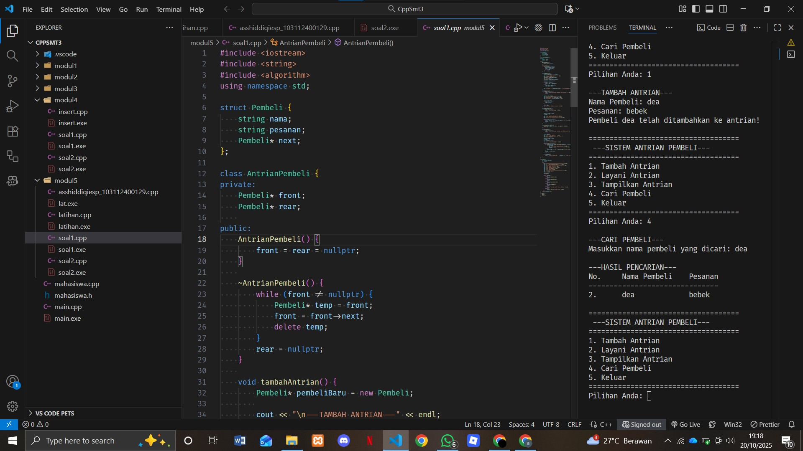
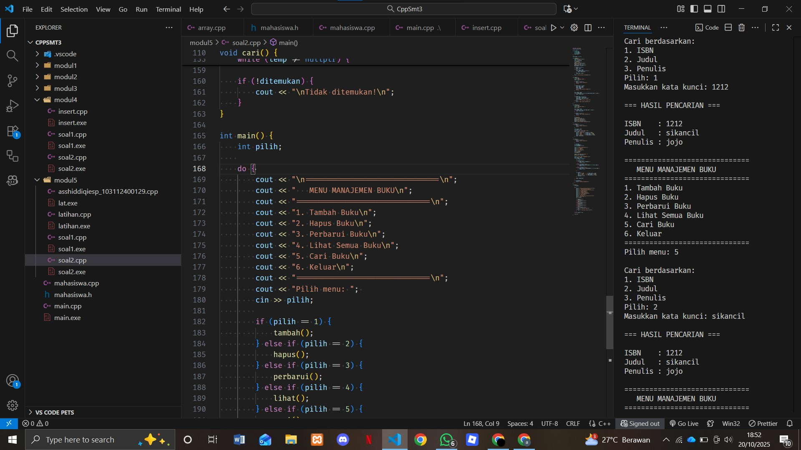

# <h1 align="center">Laporan Praktikum Modul 5 <br> SINGLY LINKED LIST (BAGIAN KEDUA)</h1>
<p align="center">ASSHIDDIQIE SYABANA PUTRA - 103112400129</p>

## Dasar Teori

Singly Linked List adalah struktur data dinamis yang terdiri dari rangkaian node, di mana setiap node menyimpan data dan pointer ke node berikutnya. Operasi dasarnya meliputi pencarian, penambahan, penghapusan, serta manipulasi seperti menyalin dan membalik list. Proses pencarian dilakukan dengan menelusuri tiap node hingga data ditemukan. Dalam C++, semua operasi ini diimplementasikan menggunakan ADT (Abstract Data Type) melalui file header (*.h) dan implementasi (*.cpp), sehingga pengelolaan memori menjadi lebih fleksibel dibandingkan array statis.


## Guided

## searching
```go
#include <iostream>
using namespace std;

#define Nil nullptr

// Deklarasi struktur Node
struct Node {
    int info;
    Node* next;

    Node(int value) {
        info = value;
        next = Nil;
    }
};

// Kelas List
class List {
private:
    Node* first;

public:
    // Konstruktor
    List() {
        first = Nil;
    }

    // Mengecek apakah list kosong
    bool isEmpty() {
        return first == Nil;
    }

    // Membuat list kosong
    void createList() {
        first = Nil;
    }

    // Menampilkan isi list
    void printInfo() {
        if (isEmpty()) {
            cout << "List kosong" << endl;
        } else {
            Node* p = first;
            cout << "Isi list: ";
            while (p != Nil) {
                cout << p->info << " ";
                p = p->next;
            }
            cout << endl;
        }
    }

    // Menghitung jumlah elemen
    int nbList() {
        int count = 0;
        Node* p = first;
        while (p != Nil) {
            count++;
            p = p->next;
        }
        return count;
    }

    // Menyisipkan elemen di awal
    void insertFirst(int value) {
        Node* p = new Node(value);
        p->next = first;
        first = p;
    }

    // Menyisipkan elemen di akhir
    void insertLast(int value) {
        Node* p = new Node(value);
        if (isEmpty()) {
            first = p;
        } else {
            Node* last = first;
            while (last->next != Nil) {
                last = last->next;
            }
            last->next = p;
        }
    }

    // Menyisipkan elemen setelah node tertentu
    void insertAfter(Node* prec, int value) {
        if (prec != Nil) {
            Node* p = new Node(value);
            p->next = prec->next;
            prec->next = p;
        }
    }

    // Menghapus elemen pertama
    void delFirst() {
        if (!isEmpty()) {
            Node* temp = first;
            first = first->next;
            delete temp;
        }
    }

    // Menghapus elemen terakhir
    void delLast() {
        if (!isEmpty()) {
            if (first->next == Nil) {
                delete first;
                first = Nil;
            } else {
                Node* prev = Nil;
                Node* curr = first;
                while (curr->next != Nil) {
                    prev = curr;
                    curr = curr->next;
                }
                prev->next = Nil;
                delete curr;
            }
        }
    }

    // Menghapus elemen setelah node tertentu
    void delAfter(Node* prec) {
        if (prec != Nil && prec->next != Nil) {
            Node* temp = prec->next;
            prec->next = temp->next;
            delete temp;
        }
    }

    // Menghapus elemen dengan nilai tertentu
    void delP(int value) {
        if (isEmpty()) return;

        Node* curr = first;
        Node* prev = Nil;

        while (curr != Nil && curr->info != value) {
            prev = curr;
            curr = curr->next;
        }

        if (curr != Nil) { // ditemukan
            if (prev == Nil)
                first = curr->next;
            else
                prev->next = curr->next;
            delete curr;
        }
    }

    // Mencari elemen dengan nilai tertentu
    Node* findElm(int value) {
        Node* p = first;
        while (p != Nil) {
            if (p->info == value)
                return p;
            p = p->next;
        }
        return Nil;
    }

    // Membalik urutan elemen list
    void invertList() {
        Node* prev = Nil;
        Node* curr = first;
        Node* next = Nil;

        while (curr != Nil) {
            next = curr->next;
            curr->next = prev;
            prev = curr;
            curr = next;
        }
        first = prev;
    }

    // Menghapus semua elemen list
    void delAll() {
        Node* p = first;
        while (p != Nil) {
            Node* temp = p;
            p = p->next;
            delete temp;
        }
        first = Nil;
    }

    // Menyalin isi list ke list lain
    void copyList(List &L2) {
        delAll();
        Node* p = first;
        while (p != Nil) {
            L2.insertLast(p->info);
            p = p->next;
        }
    }

    // Destruktor
    ~List() {
        delAll();
    }
};

// Contoh penggunaan dalam main
int main() {
    List L;

    cout << "=== Program Linked List C++ ===" << endl;

    L.insertFirst(10);
    L.insertFirst(5);
    L.insertLast(15);
    L.insertLast(20);

    L.printInfo(); // Output: 5 10 15 20
    cout << "Jumlah elemen: " << L.nbList() << endl;

    cout << "Hapus elemen pertama..." << endl;
    L.delFirst();
    L.printInfo();

    cout << "Hapus elemen terakhir..." << endl;
    L.delLast();
    L.printInfo();

    cout << "Cari elemen bernilai 10..." << endl;
    Node* found = L.findElm(10);
    if (found) cout << "Ditemukan: " << found->info << endl;
    else cout << "Tidak ditemukan" << endl;

    cout << "Balik urutan list..." << endl;
    L.invertList();
    L.printInfo();

    cout << "Hapus semua elemen..." << endl;
    L.delAll();
    L.printInfo();

    return 0;
}
```

### linklist
```cpp
#include <iostream>
#include <string>
using namespace std;

// Struktur data untuk pembeli
struct Pembeli {
    string nama;
    string pesanan;
    Pembeli* next;
};

class AntrianPembeli {
private:
    Pembeli* front;
    Pembeli* rear;
    
public:
    // Constructor
    AntrianPembeli() {
        front = rear = nullptr;
    }
    
    // Destructor - SUDAH BENAR
    ~AntrianPembeli() {
        while (front != nullptr) {
            Pembeli* temp = front;
            front = front->next;
            delete temp;
        }
        rear = nullptr;
    }
    
    // Fungsi untuk menambah antrian
    void tambahAntrian() {
        Pembeli* pembeliBaru = new Pembeli;
        
        cout << "\n---TAMBAH ANTRIAN---" << endl;
        cout << "Nama Pembeli: ";
        getline(cin, pembeliBaru->nama);
        cout << "Pesanan: ";
        getline(cin, pembeliBaru->pesanan);
        
        pembeliBaru->next = nullptr;
        
        if (rear == nullptr) {
            // Jika antrian kosong
            front = rear = pembeliBaru;
        } else {
            // Tambah di belakang
            rear->next = pembeliBaru;
            rear = pembeliBaru;
        }
        
        cout << "Pembeli " << pembeliBaru->nama << " telah ditambahkan ke antrian!" << endl;
    }
    
    // Fungsi untuk melayani antrian (menghapus dari depan)
    void layaniAntrian() {
        if (front == nullptr) {
            cout << "\nAntrian kosong! Tidak ada yang dilayani." << endl;
            return;
        }
        
        Pembeli* temp = front;
        cout << "\n---MELAYANI ANTRIAN---" << endl;
        cout << "Melayani: " << front->nama << endl;
        cout << "Pesanan: " << front->pesanan << endl;
        
        front = front->next;
        
        if (front == nullptr) {
            rear = nullptr; // Antrian menjadi kosong
        }
        
        delete temp;
        cout << "Antrian berhasil dilayani!" << endl;
    }
    
    // Fungsi untuk menampilkan antrian
    void tampilkanAntrian() {
        if (front == nullptr) {
            cout << "\nAntrian kosong!" << endl;
            return;
        }
        
        Pembeli* current = front;
        int nomor = 1;
        
        cout << "\n---DAFTAR ANTRIAN---" << endl;
        cout << "No.\tNama Pembeli\tPesanan" << endl;
        cout << "-------------------------------" << endl;
        
        while (current != nullptr) {
            cout << nomor << ".\t" << current->nama << "\t\t" << current->pesanan << endl;
            current = current->next;
            nomor++;
        }
    }
};

// Menu utama
void menu() {
    AntrianPembeli antrian;
    int pilihan;
    
    do {
        cout << "\n ---SISTEM ANTRIAN PEMBELI--- " << endl;
        cout << "1. Tambah Antrian" << endl;
        cout << "2. Layani Antrian" << endl;
        cout << "3. Tampilkan Antrian" << endl;
        cout << "4. Keluar" << endl;
        cout << "Pilihan Anda: ";
        cin >> pilihan;
        
        cin.ignore(); //Membersihkan newline character
        
        switch (pilihan) {
            case 1:
                antrian.tambahAntrian();
                break;
            case 2:
                antrian.layaniAntrian();
                break;
            case 3:
                antrian.tampilkanAntrian();
                break;
            case 4:
                cout << "\nTerima kasih! Program selesai." << endl;
                break;
            default:
                cout << "\nPilihan tidak valid!" << endl;
        }
    } while (pilihan != 4);
}

int main() {
    menu();
    return 0;
}
```
### linklist
```go
#include <iostream>
using namespace std;

// Struktur Node
struct Node {
    int data;
    Node* next;
};

// Pointer awal dan akhir
Node* head = nullptr;

// Fungsi untuk membuat node baru
Node* createNode(int data) {
    Node* newNode = new Node();
    newNode->data = data;
    newNode->next = nullptr;
    return newNode;
}


void insertBelakang(int data) {
    Node* newNode = createNode(data);
    if (head == nullptr) {
        head = newNode;
    } else {
        Node* temp = head;
        while (temp->next != nullptr) {
            temp = temp->next;
        }
        temp->next = newNode;
    }
    cout << "Data " << data << " berhasil ditambahkan di belakang.\n";
}

void insertSetelah(int target, int dataBaru) {
    Node* temp = head;
    while (temp != nullptr && temp->data != target) {
        temp = temp->next;
    }

    if (temp == nullptr) {
        cout << "Data " << target << " tidak ditemukan!\n";
    } else {
        Node* newNode = createNode(dataBaru);
        newNode->next = temp->next;
        temp->next = newNode;
        cout << "Data " << dataBaru << " berhasil disisipkan setelah " << target << ".\n";
    }
}

// ========== DELETE FUNCTION ==========
void hapusNode(int data) {
    if (head == nullptr) {
        cout << "List kosong!\n";
        return;
    }

    Node* temp = head;
    Node* prev = nullptr;

    // Jika data di node pertama
    if (temp != nullptr && temp->data == data) {
        head = temp->next;
        delete temp;
        cout << "Data " << data << " berhasil dihapus.\n";
        return;
    }

    // Cari node yang akan dihapus
    while (temp != nullptr && temp->data != data) {
        prev = temp;
        temp = temp->next;
    }

    // Jika data tidak ditemukan
    if (temp == nullptr) {
        cout << "Data " << data << " tidak ditemukan!\n";
        return;
    }

    prev->next = temp->next;
    delete temp;
    cout << "Data " << data << " berhasil dihapus.\n";
}

// ========== UPDATE FUNCTION ==========
void updateNode(int dataLama, int dataBaru) {
    Node* temp = head;
    while (temp != nullptr && temp->data != dataLama) {
        temp = temp->next;
    }

    if (temp == nullptr) {
        cout << "Data " << dataLama << " tidak ditemukan!\n";
    } else {
        temp->data = dataBaru;
        cout << "Data " << dataLama << " berhasil diupdate menjadi " << dataBaru << ".\n";
    }
}

// ========== DISPLAY FUNCTION ==========
void tampilkanList() {
    if (head == nullptr) {
        cout << "List kosong!\n";
        return;
    }

    Node* temp = head;
    cout << "Isi Linked List: ";
    while (temp != nullptr) {
        cout << temp->data << " -> ";
        temp = temp->next
    }
    cout << "NULL\n";
}

// ========== MAIN PROGRAM ==========
int main() {
    int pilihan, data, target, dataBaru;

    do {
        cout << "\n=== MENU SINGLE LINKED LIST ===\n";
        cout << "1. Insert Depan\n";
        cout << "2. Insert Belakang\n";
        cout << "3. Insert Setelah\n";
        cout << "4. Hapus Data\n";
        cout << "5. Update Data\n";
        cout << "6. Tampilkan List\n";
        cout << "0. Keluar\n";
        cout << "Pilih: ";
        cin >> pilihan;

        switch (pilihan) {
            case 1:
                cout << "Masukkan data: ";
                cin >> data;
                insertDepan(data);
                break;
            case 2:
                cout << "Masukkan data: ";
                cin >> data;
                insertBelakang(data);
                break;
            case 3:
                cout << "Masukkan data target: ";
                cin >> target;
                cout << "Masukkan data baru: ";
                cin >> dataBaru;
                insertSetelah(target, dataBaru);
                break;
            case 4:
                cout << "Masukkan data yang ingin dihapus: ";
                cin >> data;
                hapusNode(data);
                break;
            case 5:
                cout << "Masukkan data lama: ";
                cin >> data;
                cout << "Masukkan data baru: ";
                cin >> dataBaru;
                updateNode(data, dataBaru);
                break;
            case 6:
                tampilkanList();
                break;
            case 0:
                cout << "Program selesai.\n";
                break;
            default:
                cout << "Pilihan tidak valid!\n";
        }
    } while (pilihan != 0);

    return 0;
}

```


## Unguided

### Soal 1

buatlah searcing untuk mencari nama pembeli pada unguided sebelumnya(modul 4 nomor 1)
```go
#include <iostream>
#include <string>
#include <algorithm>
using namespace std;

struct Pembeli {
    string nama;
    string pesanan;
    Pembeli* next;
};

class AntrianPembeli {
private:
    Pembeli* front;
    Pembeli* rear;
    
public:
    AntrianPembeli() {
        front = rear = nullptr;
    }
    
    ~AntrianPembeli() {
        while (front != nullptr) {
            Pembeli* temp = front;
            front = front->next;
            delete temp;
        }
        rear = nullptr;
    }
    
    void tambahAntrian() {
        Pembeli* pembeliBaru = new Pembeli;
        
        cout << "\n---TAMBAH ANTRIAN---" << endl;
        cout << "Nama Pembeli: ";
        getline(cin, pembeliBaru->nama);
        cout << "Pesanan: ";
        getline(cin, pembeliBaru->pesanan);
        
        pembeliBaru->next = nullptr;
        
        if (rear == nullptr) {
            front = rear = pembeliBaru;
        } else {
            rear->next = pembeliBaru;
            rear = pembeliBaru;
        }
        
        cout << "Pembeli " << pembeliBaru->nama << " telah ditambahkan ke antrian!" << endl;
    }
    
    void layaniAntrian() {
        if (front == nullptr) {
            cout << "\nAntrian kosong! Tidak ada yang dilayani." << endl;
            return;
        }
        
        Pembeli* temp = front;
        cout << "\n---MELAYANI ANTRIAN---" << endl;
        cout << "Melayani: " << front->nama << endl;
        cout << "Pesanan: " << front->pesanan << endl;
        
        front = front->next;
        
        if (front == nullptr) {
            rear = nullptr;
        }
        
        delete temp;
        cout << "Antrian berhasil dilayani!" << endl;
    }
    
    void tampilkanAntrian() {
        if (front == nullptr) {
            cout << "\nAntrian kosong!" << endl;
            return;
        }
        
        Pembeli* current = front;
        int nomor = 1;
        
        cout << "\n---DAFTAR ANTRIAN---" << endl;
        cout << "No.\tNama Pembeli\tPesanan" << endl;
        cout << "-------------------------------" << endl;
        
        while (current != nullptr) {
            cout << nomor << ".\t" << current->nama << "\t\t" << current->pesanan << endl;
            current = current->next;
            nomor++;
        }
    }
    
    string toLower(string str) {
        transform(str.begin(), str.end(), str.begin(), ::tolower);
        return str;
    }
    
    void cariPembeli() {
        if (front == nullptr) {
            cout << "\nAntrian kosong! Tidak ada data untuk dicari." << endl;
            return;
        }
        
        string namaCari;
        cout << "\n---CARI PEMBELI---" << endl;
        cout << "Masukkan nama pembeli yang dicari: ";
        getline(cin, namaCari);
        
        Pembeli* current = front;
        int nomor = 1;
        bool ditemukan = false;
        
        cout << "\n---HASIL PENCARIAN---" << endl;
        
        while (current != nullptr) {
            if (toLower(current->nama).find(toLower(namaCari)) != string::npos) {
                if (!ditemukan) {
                    cout << "No.\tNama Pembeli\tPesanan" << endl;
                    cout << "-------------------------------" << endl;
                    ditemukan = true;
                }
                cout << nomor << ".\t" << current->nama << "\t\t" << current->pesanan << endl;
            }
            current = current->next;
            nomor++;
        }
        
        if (!ditemukan) {
            cout << "Pembeli dengan nama '" << namaCari << "' tidak ditemukan dalam antrian." << endl;
        }
    }
};

void menu() {
    AntrianPembeli antrian;
    int pilihan;
    
    do {
        cout << "\n====================================" << endl;
        cout << " ---SISTEM ANTRIAN PEMBELI--- " << endl;
        cout << "====================================" << endl;
        cout << "1. Tambah Antrian" << endl;
        cout << "2. Layani Antrian" << endl;
        cout << "3. Tampilkan Antrian" << endl;
        cout << "4. Cari Pembeli" << endl;
        cout << "5. Keluar" << endl;
        cout << "====================================" << endl;
        cout << "Pilihan Anda: ";
        cin >> pilihan;
        
        cin.ignore();
        
        switch (pilihan) {
            case 1:
                antrian.tambahAntrian();
                break;
            case 2:
                antrian.layaniAntrian();
                break;
            case 3:
                antrian.tampilkanAntrian();
                break;
            case 4:
                antrian.cariPembeli();
                break;
            case 5:
                cout << "\nTerima kasih! Program selesai." << endl;
                break;
            default:
                cout << "\nPilihan tidak valid!" << endl;
        }
    } while (pilihan != 5);
}

int main() {
    menu();
    return 0;
}
```

> Output
> 

Penjelasan Kode:
1. Fungsi **CariPembeli()**
```cpp
void cariPembeli() {
    if (front == nullptr) {
        cout << "\nAntrian kosong! Tidak ada data untuk dicari." << endl;
        return;
    }
    
    string namaCari;
    cout << "\n---CARI PEMBELI---" << endl;
    cout << "Masukkan nama pembeli yang dicari: ";
    getline(cin, namaCari);
    
    Pembeli* current = front;
    int nomor = 1;
    bool ditemukan = false;
    
    cout << "\n---HASIL PENCARIAN---" << endl;
    
    while (current != nullptr) {
        if (toLower(current->nama).find(toLower(namaCari)) != string::npos) {
            if (!ditemukan) {
                cout << "No.\tNama Pembeli\tPesanan" << endl;
                cout << "-------------------------------" << endl;
                ditemukan = true;
            }
            cout << nomor << ".\t" << current->nama << "\t\t" << current->pesanan << endl;
        }
        current = current->next;
        nomor++;
    }
    
    if (!ditemukan) {
        cout << "Pembeli dengan nama '" << namaCari << "' tidak ditemukan dalam antrian." << endl;
    }
}
```

Alur Pencarian:
1. Pengecekan Antrian Kosong

    Memeriksa apakah front == nullptr

    Jika antrian kosong, langsung keluar dari fungsi

2. Input Kata Kunci

    Meminta pengguna memasukkan nama yang ingin dicari

3. Traversal Linked List

    Pointer current mulai dari front

    Melakukan iterasi melalui seluruh node dalam linked list

4. Pencarian Case-Insensitive

    Menggunakan fungsi toLower() untuk mengubah kedua string (data dan pencarian) menjadi huruf kecil

    Menggunakan string::find() untuk mencari substring

5. Pencocokan Parsial

    find() != string::npos berarti pencarian berhasil menemukan kecocokan

    Pencarian bersifat partial match (cocok dengan bagian nama)

6. Menampilkan Hasil

    Jika ditemukan, menampilkan dalam format tabel

    Jika tidak ditemukan, menampilkan pesan error

### Soal 2

gunakan latihan pada pertemuan minggun ini dan tambahkan searching untuk mencari buku berdasarkan judul, penulis, dan ISBN
```go
#include <iostream>
using namespace std;

struct Buku {
    string isbn;
    string judul;
    string penulis;
    Buku* next;
};

Buku* head = nullptr;

void tambah() {
    Buku* baru = new Buku();
    cout << "ISBN: "; cin >> baru->isbn;
    cout << "Judul: "; cin.ignore(); getline(cin, baru->judul);
    cout << "Penulis: "; getline(cin, baru->penulis);
    baru->next = nullptr;
    
    if (head == nullptr) {
        head = baru;
    } else {
        Buku* temp = head;
        while (temp->next != nullptr) temp = temp->next;
        temp->next = baru;
    }
    cout << "Berhasil!\n";
}

void hapus() {
    string isbn;
    cout << "ISBN: "; cin >> isbn;
    
    if (head == nullptr) {
        cout << "Kosong!\n";
        return;
    }
    
    if (head->isbn == isbn) {
        Buku* temp = head;
        head = head->next;
        delete temp;
        cout << "Dihapus!\n";
        return;
    }
    
    Buku* temp = head;
    while (temp->next != nullptr && temp->next->isbn != isbn) {
        temp = temp->next;
    }
    
    if (temp->next != nullptr) {
        Buku* hapus = temp->next;
        temp->next = temp->next->next;
        delete hapus;
        cout << "Dihapus!\n";
    } else {
        cout << "Tidak ada!\n";
    }
}

void perbarui() {
    string isbn;
    cout << "ISBN: "; cin >> isbn;
    
    Buku* temp = head;
    while (temp != nullptr && temp->isbn != isbn) {
        temp = temp->next;
    }
    
    if (temp == nullptr) {
        cout << "Tidak ada!\n";
        return;
    }
    
    cout << "Judul baru: "; cin.ignore(); getline(cin, temp->judul);
    cout << "Penulis baru: "; getline(cin, temp->penulis);
    cout << "Diperbarui!\n";
}

void lihat() {
    if (head == nullptr) {
        cout << "Kosong!\n";
        return;
    }
    
    Buku* temp = head;
    while (temp != nullptr) {
        cout << "\nISBN: " << temp->isbn;
        cout << "\nJudul: " << temp->judul;
        cout << "\nPenulis: " << temp->penulis << "\n";
        temp = temp->next;
    }
}

void cari() {
    if (head == nullptr) {
        cout << "Kosong!\n";
        return;
    }

    int pilihan;
    string kataKunci;
    bool ditemukan = false;

    cout << "\nCari berdasarkan:\n";
    cout << "1. ISBN\n";
    cout << "2. Judul\n";
    cout << "3. Penulis\n";
    cout << "Pilih: "; cin >> pilihan;
    cin.ignore(); // Membersihkan newline dari buffer

    cout << "Masukkan kata kunci: ";
    getline(cin, kataKunci);

    Buku* temp = head;
    while (temp != nullptr) {
        bool cocok = false;
        switch (pilihan) {
            case 1:
                if (temp->isbn == kataKunci) cocok = true;
                break;
            case 2:
                if (temp->judul.find(kataKunci) != string::npos) cocok = true;
                break;
            case 3:
                if (temp->penulis.find(kataKunci) != string::npos) cocok = true;
                break;
            default:
                cout << "Pilihan tidak valid!\n";
                return;
        }

        if (cocok) {
            cout << "\nISBN: " << temp->isbn;
            cout << "\nJudul: " << temp->judul;
            cout << "\nPenulis: " << temp->penulis << "\n";
            ditemukan = true;
        }
        temp = temp->next;
    }

    if (!ditemukan) {
        cout << "Tidak ditemukan!\n";
    }
}

int main() {
    int pilih;
    
    do {
        cout << "\n=== MENU SINGLE LINKED LIST ===\n";
        cout << "1. Tambah Buku" << endl;
        cout << "2. Hapus Buku" << endl;
        cout << "3. Perbarui Buku" << endl;
        cout << "4. Lihat Buku" << endl;
        cout << "5. Cari Buku" << endl;
        cout << "6. Keluar" << endl;
        cout << "Pilih: "; cin >> pilih;
        
        if (pilih == 1) tambah();
        else if (pilih == 2) hapus();
        else if (pilih == 3) perbarui();
        else if (pilih == 4) lihat();
        else if (pilih == 5) cari();
        
    } while (pilih != 6);
    
    return 0;
}
```

> Output
> 

Penjelasan Kode:
# Penjelasan Kode Bagian Searching (Fungsi `cari()`)

## 1. Validasi Data Awal
```cpp
if (head == nullptr) {
    cout << "Daftar kosong!\n";
    return;
}
```
- **Tujuan**: Memastikan ada data yang bisa dicari
- **Cara**: Mengecek apakah pointer `head` bernilai `nullptr`
- **Hasil**: Jika kosong, program berhenti dan menampilkan pesan

## 2. Input Kriteria Pencarian
```cpp
int pilihan;
string kataKunci;
bool ditemukan = false;

cout << "\nCari berdasarkan:\n";
cout << "1. ISBN\n";
cout << "2. Judul\n";
cout << "3. Penulis\n";
cout << "Pilih: "; 
cin >> pilihan;
cin.ignore();

cout << "Masukkan kata kunci: ";
getline(cin, kataKunci);
```
- **Variabel**:
  - `pilihan`: Menyimpan kriteria pencarian (1, 2, atau 3)
  - `kataKunci`: Menyimpan teks yang akan dicari
  - `ditemukan`: Flag boolean untuk menandai hasil pencarian
- **Fungsi `cin.ignore()`**: Membersihkan newline character dari buffer input

## 3. Inisialisasi Proses Pencarian
```cpp
cout << "\n=== HASIL PENCARIAN ===\n";
Buku* temp = head;
```
- **Pointer `temp`**: Digunakan untuk menelusuri linked list, dimulai dari node pertama (`head`)

## 4. Looping Traversal Linked List
```cpp
while (temp != nullptr) {
    bool cocok = false;
    // Logika pencocokan...
    temp = temp->next;
}
```
- **Mekanisme**: Loop melalui setiap node sampai mencapai akhir (`nullptr`)
- **Iterasi**: `temp = temp->next` memindahkan pointer ke node berikutnya

## 5. Logika Pencocokan Data
```cpp
if (pilihan == 1) {
    if (temp->isbn == kataKunci) {
        cocok = true;
    }
} else if (pilihan == 2) {
    if (temp->judul.find(kataKunci) != string::npos) {
        cocok = true;
    }
} else if (pilihan == 3) {
    if (temp->penulis.find(kataKunci) != string::npos) {
        cocok = true;
    }
}
```
- **ISBN**: Exact match menggunakan operator `==`
- **Judul & Penulis**: Partial match menggunakan `string::find()`
- **`string::npos`**: Nilai konstanta yang berarti "tidak ditemukan"

## 6. Output Data yang Cocok
```cpp
if (cocok) {
    cout << "\nISBN    : " << temp->isbn << endl;
    cout << "Judul   : " << temp->judul << endl;
    cout << "Penulis : " << temp->penulis << endl;
    ditemukan = true;
}
```
- **Tampilan**: Menampilkan detail buku yang memenuhi kriteria
- **Update Flag**: Mengubah `ditemukan` menjadi `true`

## 7. Final Check dan Pesan Error
```cpp
if (!ditemukan) {
    cout << "\nTidak ditemukan!\n";
}
```
- **Kondisi**: Jika tidak ada data yang cocok setelah traversal selesai
- **Output**: Menampilkan pesan "Tidak ditemukan"

## Referensi

1. https://www.w3schools.com/cpp/cpp_for_loop_nested.asp
2. https://www.w3schools.com/cpp/cpp_arrays.asp
3. https://www.w3schools.com/cpp/cpp_arrays_loop.asp
4. https://www.w3schools.com/cpp/cpp_references.asp
5. https://www.w3schools.com/cpp/cpp_pointers.asp
6. https://www.w3schools.com/cpp/cpp_function_param.asp
7. https://www.w3schools.com/cpp/cpp_function_array.asp
8. https://www.geeksforgeeks.org/dsa/linked-list-data-structure/
9. https://en.wikipedia.org/wiki/Linked_list

