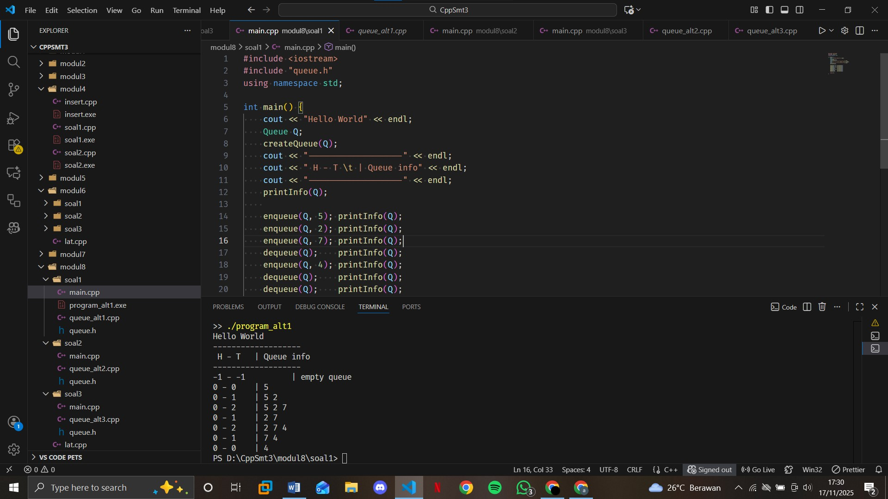
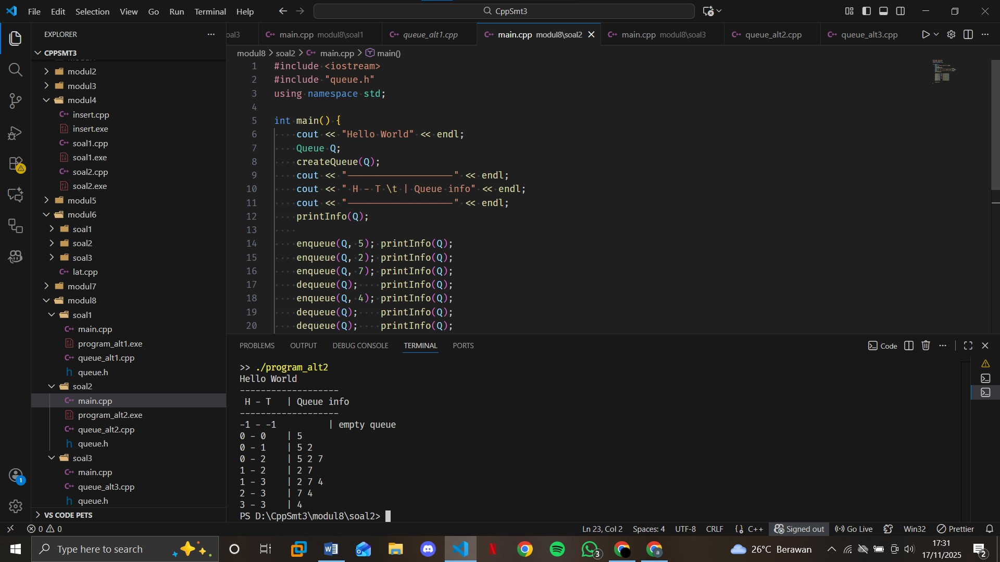
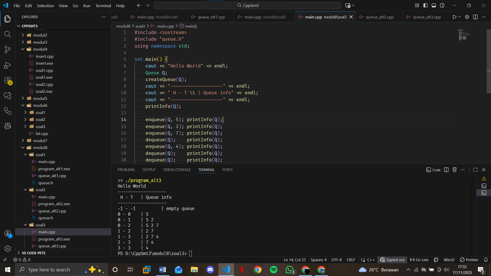

# <h1 align="center">Laporan Praktikum Modul 8 <br> QUEUE </h1>
<p align="center">ASSHIDDIQIE SYABANA PUTRA - 103112400129 </p>

## Dasar Teori

Stack adalah struktur data linear dengan prinsip **LIFO (Last In First Out)**, di mana elemen terakhir yang dimasukkan akan dikeluarkan pertama. Stack memiliki Queue adalah struktur data linear yang bekerja dengan prinsip **FIFO (First In First Out)**, artinya elemen yang pertama masuk menjadi elemen pertama yang keluar. Queue memiliki **Head** sebagai tempat menghapus elemen (dequeue) dan **Tail** sebagai tempat menambah elemen (enqueue). Operasi hanya dilakukan secara berurutan: tambah di belakang dan hapus di depan. Queue dapat dibuat menggunakan **linked list** (elemen tak terbatas dan fleksibel) atau **array** (elemen terbatas dan memerlukan pengaturan indeks). Dalam array terdapat tiga mekanisme: **head tetap–tail bergerak**, **head dan tail bergerak**, serta **circular queue** yang paling efisien karena head dan tail berputar tanpa pergeseran. Queue biasa digunakan pada sistem antrean seperti antrian layanan, buffer printer, dan penjadwalan proses CPU.


## Guided

### queue
```go
#include <iostream>
using namespace std;

// ukuran maksimal queue
#define MAX 5

// struktur queue
struct Queue {
   // datanya pake array yaa, bukan linked list
   int data[MAX];
   int head;
   int tail;
};

// membuat antrian kosong
void buat_queue (Queue &Q) {
   Q.head = -1;
   Q.tail = -1;
   // kenapa head dan tail-nya -1?
   // karena index array mulai dari 0
}

// cek queueu-nya kosong ngga?
bool cek_kosong (Queue Q) {
   return (Q.head == -1 && Q.tail == -1);
}

// cek queue-nya penuh ngga?
bool cek_penuh (Queue Q) {
   return (Q.tail == MAX - 1);
}

// menampilkan isi queue
void print_queue (Queue Q) {
   if (cek_kosong(Q)) {
      cout << "queue kosong" << endl;
   } else {
      cout << "queue : ";
      for (int i = Q.head; i <= Q.tail; i++) {
         cout << Q.data[i] << " -> ";
      }
      cout << endl;
   }
}

// menambahkan elemen (enqueue)
void enqueue (Queue &Q, int x) {
   if (cek_penuh(Q)) {
      cout << "queue sudah penuh, tidak bisa menambah data" << endl;
   } else {
      if (cek_kosong(Q)) {
         Q.head = Q.tail = 0;
      } else {
         Q.tail++;
      }

      Q.data[Q.tail] = x;
      cout << "menambahkan " << x << " ke dalam queue" << endl;
   }
}

// menghapus elemen (dequeue)
void dequeue (Queue &Q) {
   if (cek_kosong(Q)) {
      cout << "queue kosong, tidak ada yang bisa dihapus" << endl;
   } else {
      cout << "dequeue " << Q.data[Q.head] << " dari dalam queue" << endl;

      // jika hanya ada 1 elemen
      if (Q.head == Q.tail) {
         Q.head = Q.tail = -1;
      } else {
         // geser semua elemen ke depan/kiri
         // biar tempat kosong di depan dipenuhin
         // dan tempat di belakang bisa dikosongin
         for (int i = Q.head; i < Q.tail; i++) {
            Q.data[i] = Q.data[i + 1];
         }

         Q.tail--;
      }
   }
}

// eksekutor
int main() {
   Queue Q;
   buat_queue(Q);

   enqueue(Q, 5);
   enqueue(Q, 2);
   enqueue(Q, 7);
   print_queue(Q);

   dequeue(Q);
   print_queue(Q);

   enqueue(Q, 4);
   enqueue(Q, 9);
   print_queue(Q);

   dequeue(Q);
   dequeue(Q);
   print_queue(Q);

   return 0;
}
```

## Unguided

### Soal 1

Buatlah ADT Stack menggunakan ARRAY sebagai berikut di dalam file “queue.h”:
```go
Type infotype: integer
Type Queue: <
info : array [5] of infotype {index array dalam C++
dimulai dari 0}
head, tail : integer
>
procedure CreateQueue (input/output Q: Queue)
function isEmptyQueue (Q: Queue) → boolean
function isFullQueue (Q: Queue) → boolean
procedure enqueue (input/output Q: Queue, input x: infotype)
function dequeue (input/output Q: Queue) → infotype
procedure printInfo (input Q: Queue)
```

Buatlah implementasi ADT Queue pada file “queue.cpp” dengan menerapkan mekanisme queue Alternatif 1 (head diam, tail bergerak).
```go
int main() {
cout << "Hello World" << endl;
Queue Q;
createQueue(Q);
cout<<"----------------------"<<endl;
cout<<" H - T \t | Queue info"<<endl;
cout<<"----------------------"<<endl;
printInfo(Q);
enqueue(Q,5); printInfo(Q);
enqueue(Q,2); printInfo(Q);
enqueue(Q,7); printInfo(Q);
dequeue(Q); printInfo(Q);
enqueue(Q,4); printInfo(Q);
dequeue(Q); printInfo(Q);
dequeue(Q); printInfo(Q);
return 0;
}
```
### file queue.h
```cpp
#ifndef QUEUE_H
#define QUEUE_H

typedef int infotype;
const int MAX = 5; // ukuran queue

struct Queue {
    infotype info[MAX];
    int head;
    int tail;
};

// Prototype fungsi
void createQueue(Queue &Q);
bool isEmptyQueue(Queue Q);
bool isFullQueue(Queue Q);
void enqueue(Queue &Q, infotype x);
infotype dequeue(Queue &Q);
void printInfo(Queue Q);

#endif
```
### file queue_alt1.cpp
```cpp
#include <iostream>
#include "queue.h"
using namespace std;

void createQueue(Queue &Q) {
    Q.head = -1;
    Q.tail = -1;
}

bool isEmptyQueue(Queue Q) {
    return (Q.head == -1 && Q.tail == -1);
}

bool isFullQueue(Queue Q) {
    return (Q.tail == MAX - 1);
}

void enqueue(Queue &Q, infotype x) {
    if (isFullQueue(Q)) {
        cout << "Queue penuh! Tidak bisa menambahkan " << x << endl;
        return;
    }
    
    if (isEmptyQueue(Q)) {
        Q.head = 0;
        Q.tail = 0;
    } else {
        Q.tail++;
    }
    Q.info[Q.tail] = x;
}

infotype dequeue(Queue &Q) {
    infotype x;
    
    if (isEmptyQueue(Q)) {
        cout << "Queue kosong! Tidak bisa menghapus" << endl;
        return -1;
    }
    
    x = Q.info[Q.head];
    
    if (Q.head == Q.tail) {
        // hanya ada 1 elemen
        Q.head = -1;
        Q.tail = -1;
    } else {
        // geser semua elemen ke kiri
        for (int i = Q.head + 1; i <= Q.tail; i++) {
            Q.info[i-1] = Q.info[i];
        }
        Q.tail--;
    }
    
    return x;
}

void printInfo(Queue Q) {
    cout << Q.head << " - " << Q.tail << " \t | ";
    
    if (isEmptyQueue(Q)) {
        cout << "empty queue";
    } else {
        for (int i = Q.head; i <= Q.tail; i++) {
            cout << Q.info[i] << " ";
        }
    }
    cout << endl;
}
```
### file main.cpp
```cpp
#include <iostream>
#include "queue.h"
using namespace std;

int main() {
    cout << "Hello World" << endl;
    Queue Q;
    createQueue(Q);
    cout << "-------------------" << endl;
    cout << " H - T \t | Queue info" << endl;
    cout << "-------------------" << endl;
    printInfo(Q);
    
    enqueue(Q, 5); printInfo(Q);
    enqueue(Q, 2); printInfo(Q);
    enqueue(Q, 7); printInfo(Q);
    dequeue(Q);    printInfo(Q);
    enqueue(Q, 4); printInfo(Q);
    dequeue(Q);    printInfo(Q);
    dequeue(Q);    printInfo(Q);
    
    return 0;
}
```

> Output
> 

Penjelasan :
Queue dengan pendekatan head diam dan tail bergerak merupakan implementasi paling sederhana dimana posisi head selalu tetap pada indeks awal array (biasanya indeks 0), sedangkan tail akan bergerak maju seiring penambahan elemen baru. Ketika terjadi proses penghapusan elemen dari head, semua elemen yang tersisa dalam antrian harus digeser ke posisi depan untuk mengisi kekosongan, mirip dengan antrian fisik dimana semua orang harus maju ketika orang depan keluar. Meskipun konsepnya mudah dipahami, implementasi ini kurang efisien karena membutuhkan banyak operasi pergeseran elemen, khususnya ketika ukuran queue besar, sehingga cocok untuk situasi dengan jumlah elemen sedikit dan frekuensi operasi yang rendah.

### Soal 2
Buatlah implementasi ADT Queue pada file “queue.cpp” dengan menerapkan mekanisme queue Alternatif 2 (head bergerak, tail bergerak).

### file queue.h
```cpp
#ifndef QUEUE_H
#define QUEUE_H

typedef int infotype;
const int MAX = 5; // ukuran queue

struct Queue {
    infotype info[MAX];
    int head;
    int tail;
};

// Prototype fungsi
void createQueue(Queue &Q);
bool isEmptyQueue(Queue Q);
bool isFullQueue(Queue Q);
void enqueue(Queue &Q, infotype x);
infotype dequeue(Queue &Q);
void printInfo(Queue Q);

#endif
```
### file queue_alt2.cpp
```cpp
#include <iostream>
#include "queue.h"
using namespace std;

void createQueue(Queue &Q) {
    Q.head = -1;
    Q.tail = -1;
}

bool isEmptyQueue(Queue Q) {
    return (Q.head == -1 && Q.tail == -1);
}

bool isFullQueue(Queue Q) {
    return (Q.tail == MAX - 1);
}

void enqueue(Queue &Q, infotype x) {
    if (isFullQueue(Q)) {
        cout << "Queue penuh! Tidak bisa menambahkan " << x << endl;
        return;
    }
    
    if (isEmptyQueue(Q)) {
        Q.head = 0;
        Q.tail = 0;
    } else {
        Q.tail++;
    }
    Q.info[Q.tail] = x;
}

infotype dequeue(Queue &Q) {
    infotype x;
    
    if (isEmptyQueue(Q)) {
        cout << "Queue kosong! Tidak bisa menghapus" << endl;
        return -1;
    }
    
    x = Q.info[Q.head];
    
    if (Q.head == Q.tail) {
        // hanya ada 1 elemen
        Q.head = -1;
        Q.tail = -1;
    } else {
        Q.head++; // head bergerak maju
    }
    
    return x;
}

void printInfo(Queue Q) {
    cout << Q.head << " - " << Q.tail << " \t | ";
    
    if (isEmptyQueue(Q)) {
        cout << "empty queue";
    } else {
        for (int i = Q.head; i <= Q.tail; i++) {
            cout << Q.info[i] << " ";
        }
    }
    cout << endl;
}
```
### file main.cpp
```cpp
#include <iostream>
#include "queue.h"
using namespace std;

int main() {
    cout << "Hello World" << endl;
    Queue Q;
    createQueue(Q);
    cout << "-------------------" << endl;
    cout << " H - T \t | Queue info" << endl;
    cout << "-------------------" << endl;
    printInfo(Q);
    
    enqueue(Q, 5); printInfo(Q);
    enqueue(Q, 2); printInfo(Q);
    enqueue(Q, 7); printInfo(Q);
    dequeue(Q);    printInfo(Q);
    enqueue(Q, 4); printInfo(Q);
    dequeue(Q);    printInfo(Q);
    dequeue(Q);    printInfo(Q);
    
    return 0;
}
```

> Output
> 

Penjelasan :
Pada alternatif kedua, baik head maupun tail dapat bergerak maju dimana head bergerak ketika elemen dihapus dan tail bergerak ketika elemen ditambahkan. Pendekatan ini menghilangkan kebutuhan untuk menggeser elemen, sehingga lebih efisien daripada alternatif pertama karena setiap operasi hanya membutuhkan pergerakan pointer tanpa memindahkan data. Namun, implementasi ini dapat mengalami masalah "penuh semu" dimana tail sudah mencapai ujung array meskipun masih ada slot kosong di depan head, karena head telah bergerak maju meninggalkan ruang kosong di belakangnya. Sistem ini analog dengan antrian drive-thru dimana mobil tidak perlu bergerak maju ketika mobil depan telah dilayani.


### Soal 3
Buatlah implementasi ADT Queue pada file “queue.cpp” dengan menerapkan mekanisme queue Alternatif 3 (head dan tail berputar).

### file queue.h
```cpp
#ifndef QUEUE_H
#define QUEUE_H

typedef int infotype;
const int MAX = 5; // ukuran queue

struct Queue {
    infotype info[MAX];
    int head;
    int tail;
};

// Prototype fungsi
void createQueue(Queue &Q);
bool isEmptyQueue(Queue Q);
bool isFullQueue(Queue Q);
void enqueue(Queue &Q, infotype x);
infotype dequeue(Queue &Q);
void printInfo(Queue Q);

#endif
```
### file queue_alt3.cpp
```cpp
#include <iostream>
#include "queue.h"
using namespace std;

void createQueue(Queue &Q) {
    Q.head = -1;
    Q.tail = -1;
}

bool isEmptyQueue(Queue Q) {
    return (Q.head == -1 && Q.tail == -1);
}

bool isFullQueue(Queue Q) {
    return ((Q.tail + 1) % MAX == Q.head);
}

void enqueue(Queue &Q, infotype x) {
    if (isFullQueue(Q)) {
        cout << "Queue penuh! Tidak bisa menambahkan " << x << endl;
        return;
    }
    
    if (isEmptyQueue(Q)) {
        Q.head = 0;
        Q.tail = 0;
    } else {
        Q.tail = (Q.tail + 1) % MAX;
    }
    Q.info[Q.tail] = x;
}

infotype dequeue(Queue &Q) {
    infotype x;
    
    if (isEmptyQueue(Q)) {
        cout << "Queue kosong! Tidak bisa menghapus" << endl;
        return -1;
    }
    
    x = Q.info[Q.head];
    
    if (Q.head == Q.tail) {
        // hanya ada 1 elemen
        Q.head = -1;
        Q.tail = -1;
    } else {
        Q.head = (Q.head + 1) % MAX;
    }
    
    return x;
}

void printInfo(Queue Q) {
    cout << Q.head << " - " << Q.tail << " \t | ";
    
    if (isEmptyQueue(Q)) {
        cout << "empty queue";
    } else {
        int i = Q.head;
        while (true) {
            cout << Q.info[i] << " ";
            if (i == Q.tail) break;
            i = (i + 1) % MAX;
        }
    }
    cout << endl;
}
```
### file main.cpp
```cpp
#include <iostream>
#include "queue.h"
using namespace std;

int main() {
    cout << "Hello World" << endl;
    Queue Q;
    createQueue(Q);
    cout << "-------------------" << endl;
    cout << " H - T \t | Queue info" << endl;
    cout << "-------------------" << endl;
    printInfo(Q);
    
    enqueue(Q, 5); printInfo(Q);
    enqueue(Q, 2); printInfo(Q);
    enqueue(Q, 7); printInfo(Q);
    dequeue(Q);    printInfo(Q);
    enqueue(Q, 4); printInfo(Q);
    dequeue(Q);    printInfo(Q);
    dequeue(Q);    printInfo(Q);
    
    return 0;
}
```

> Output
> 


Penjelasan :
Alternatif ketiga menggunakan konsep circular buffer dimana array diperlakukan sebagai buffer melingkar dan kedua pointer head dan tail dapat "berputar" menggunakan operasi modulo. Ketika head atau tail mencapai akhir array, mereka akan kembali ke awal array, memastikan semua slot dapat dimanfaatkan secara optimal tanpa mengalami masalah "penuh semu". Implementasi ini memberikan efisiensi tertinggi dengan utilisasi memory yang maksimal dan performa operasi yang konsisten, meskipun logika implementasinya lebih kompleks dibandingkan kedua alternatif sebelumnya. Konsep ini mirip dengan meja bundar restoran dimana kursi dapat digunakan secara berurutan tanpa memperdulikan posisi awal dan akhir.

## Referensi

1. https://www.w3schools.com/cpp/cpp_for_loop_nested.asp
2. https://www.w3schools.com/cpp/cpp_arrays.asp
3. https://www.w3schools.com/cpp/cpp_arrays_loop.asp
4. https://www.w3schools.com/cpp/cpp_references.asp
5. https://www.w3schools.com/cpp/cpp_pointers.asp
6. https://www.w3schools.com/cpp/cpp_function_param.asp
7. https://www.w3schools.com/cpp/cpp_function_array.asp
8. https://www.w3schools.com/cpp/cpp_stacks.asp
